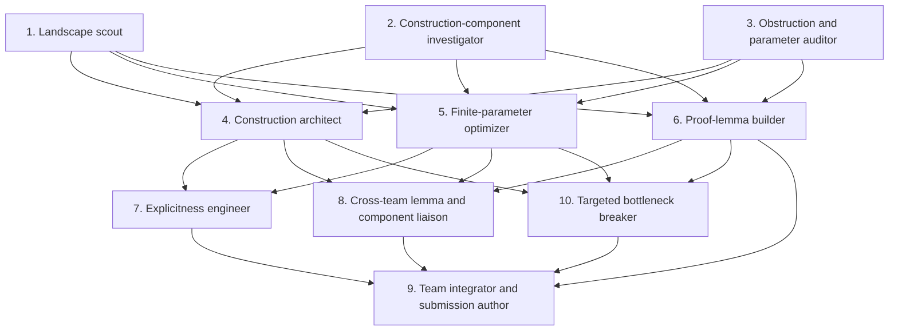

# Ten-seat team research graph

Each named team follows this directed acyclic graph.  The four teams use
different construction families, but all durable outputs, lemma-book entries,
and message-board posts are shared across the campaign.

The foundation positions identify usable tools, candidate components, and hard
obstructions. The middle positions turn their handoffs into an architecture,
finite parameter ledger, proof lemmas, full-generator-matrix algorithm, and
one targeted attempt to break the current bottleneck. The cross-team liaison
imports compatible durable work. One integrator then consolidates the results
and writes a submission only when it is complete. Formal mathematical review
happens after a submission enters the independent verifier queue. Jobs cannot
begin until their displayed predecessors have completed.

Every position reads the shared repository and message board.  The dependency
edges create focus inside a team; they do not prevent importing a useful result
from another team.
